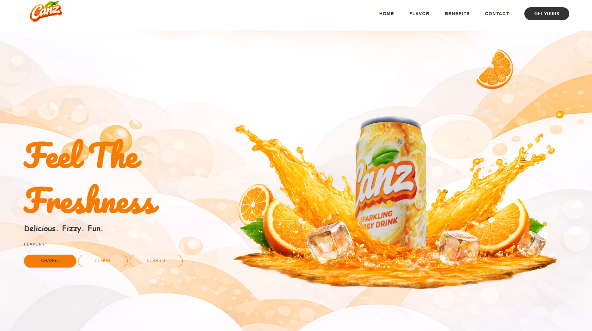

# 🥤 CANZ Landing Page

A modern, interactive landing page for **CANZ**, designed with immersive visuals, dynamic animations, and a unique **flavor-based theme system** that transforms the entire experience.

## 📸 Preview



---

## ✨ Features

- 🎨 **3D Elements**  
  Engaging 3D visuals that bring the product to life.

- 🌊 **Smooth Scrolling**  
  Seamless scrolling experience for a premium feel.

- 📊 **Progress Scroll Tracker**  
  Visual indicator showing how far the user has scrolled.

- 🎬 **Advanced Animations**  
  Clean and modern animations to enhance user interaction.

- 🔄 **Scroll-Based Animations**  
  Elements animate dynamically as the user scrolls.

- 🍊 **Flavor-Based Theme System (CANZ Style)**  
  Each flavor changes the entire website theme:

  - 🍊 Orange → Orange theme  
  - 🍋 Lemon → Green theme  
  - 🍇 Berry → Purple theme  

  This affects:
  - Background colors  
  - UI accents  
  - Buttons  
  - Overall visual mood  

---

## 🛠️ Tech Stack

- React  
- Three.js / React Three Fiber  
- JavaScript (ES6+)  
- CSS
- Material UI
- Blender

---

## 📂 Project Structure

```
/project-root
  ├── public
  ├── src
  ├── Screenshot.png
  └── README.md
```

---

## 🚀 Getting Started

```bash
npm install
npm run dev
```

---

## 💡 Concept

Instead of traditional dark/light modes, **CANZ uses a flavor-driven UI system** where each product flavor defines the entire look and feel of the website.

This creates a more dynamic and engaging user experience.
